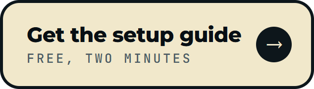
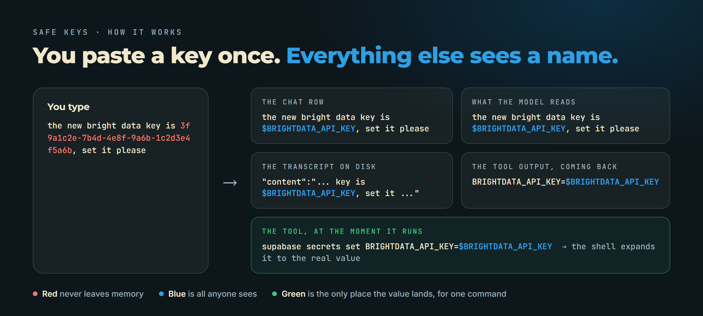

<p align="center">
  <picture>
    <source media="(prefers-color-scheme: dark)" srcset="assets/logo-dark.png">
    
  </picture>
</p>

<h3 align="center">Paste an API key into Claude Code. Nothing keeps it.</h3>
<p align="center">Not the chat, not the transcript on disk, not the screen, not the model. Your tools still get to use it.</p>

<p align="center">
  <a href="https://club.reinventing.ai/safe-keys?utm_source=github&utm_medium=readme&utm_campaign=safe-keys&utm_content=nav-guide"><strong>Setup guide</strong></a>
  &nbsp;&bull;&nbsp;
  <a href="https://club.reinventing.ai/?utm_source=github&utm_medium=readme&utm_campaign=safe-keys&utm_content=nav-club"><strong>Agent Ops Club</strong></a>
  &nbsp;&bull;&nbsp;
  <a href="https://club.reinventing.ai/ai-employees?utm_source=github&utm_medium=readme&utm_campaign=safe-keys&utm_content=nav-employees"><strong>AI Employees</strong></a>
  &nbsp;&bull;&nbsp;
  <a href="https://club.reinventing.ai/events?utm_source=github&utm_medium=readme&utm_campaign=safe-keys&utm_content=nav-sessions"><strong>Live sessions</strong></a>
  &nbsp;&bull;&nbsp;
  <a href="https://club.reinventing.ai/faq?utm_source=github&utm_medium=readme&utm_campaign=safe-keys&utm_content=nav-faq"><strong>FAQ</strong></a>
</p>

<p align="center">
  
  
  
  
</p>

<p align="center">
  <a href="https://club.reinventing.ai/safe-keys?utm_source=github&utm_medium=readme&utm_campaign=safe-keys&utm_content=btn-guide"></a>
  <a href="https://club.reinventing.ai/register?utm_source=github&utm_medium=readme&utm_campaign=safe-keys&utm_content=btn-join"></a>
  <a href="https://club.reinventing.ai/events?utm_source=github&utm_medium=readme&utm_campaign=safe-keys&utm_content=btn-sessions"></a>
  <a href="https://club.reinventing.ai/?utm_source=github&utm_medium=readme&utm_campaign=safe-keys&utm_content=btn-club"></a>
</p>

<p align="center">
  
</p>

<p align="center">
  ⭐ <em>Found something useful? Star the repo. It takes a second and helps the next person find it.</em>
</p>

## Safe Keys

You are working with Claude Code. A service emails you a new API key. You paste it into the chat and say "set this". That key is now in the conversation, in the transcript file on your disk, on your screen, and in the model's context. It stays in that transcript for as long as the file exists.

Safe Keys is a Claude Code plugin that catches the key the moment you submit it, stores it outside the conversation, and shows it everywhere as a name instead: `$OPENROUTER_API_KEY`, `$BRIGHTDATA_API_KEY`, `$SAFE_KEY_1`. When a tool needs the real value, it gets it, for that one command, and the output that comes back is cleaned before the model reads it.

I built it after pasting a Bright Data key into my own session and watching the redactor I had at the time miss it. The miss is explained in [docs/DETAILS.md](docs/DETAILS.md), and the fix is the context rule in `lib/detect.js`.

Created by [Mark Fulton](https://www.reinventing.ai/?utm_source=github&utm_medium=readme&utm_campaign=safe-keys) of Reinventing.AI, founder of [Vibe Coding is Life](https://facebook.com/groups/vibecodinglife) (340,000+ members).

## How it works

<p align="center">
  
</p>

One paste, five places it would normally land, one place it actually does.

| Where a key could land | What Safe Keys does |
|---|---|
| The prompt box, on paste | Replaced before the text is queued or drawn |
| The message the model reads | Replaced before it enters the session |
| The transcript file on disk | Every stored row is rewritten before it is written. The two records that are not rows are overwritten in place a few seconds later |
| Bash and PowerShell commands | `$NAME` is a real environment variable, so the shell expands it and the command never carries the value |
| Every other tool | The value is substituted into the arguments at the moment the tool runs |
| Tool output coming back | Stored values become names again. A key a tool prints, from a `cat .env` say, is stored and named too |
| The screen | Every drawn row is scrubbed on the terminal, the desktop app, VS Code and mobile |

Real values live in the plugin's memory for the length of the session, and nowhere else. The detector knows 38 key shapes by name (OpenAI, Anthropic, GitHub, Stripe, Supabase, AWS and the rest), reads labels like `BRIGHTDATA_API_KEY=` and `Authorization: Bearer`, and catches a bare UUID when a word like "key" or "token" sits near it, which is the case every entropy test misses. It leaves dates, versions, git SHAs, file paths and URLs alone.

## Install in two steps

**1. Turn on function hooks**, once, in `~/.claude/settings.json`:

```json
{ "env": { "CLAUDE_CODE_ENABLE_FUNCTION_HOOKS": "1" } }
```

**2. Put the plugin where Claude Code loads skills from:**

```bash
git clone https://github.com/markfulton/safe-keys ~/.claude/skills/safe-keys
```

Open a new session. The first line of the session says Safe Keys is on. Paste a key and watch the row change.

Prefer to try it in one session first? Start Claude Code with `claude --plugin-dir /path/to/safe-keys`. Function hooks are an early access surface (Claude Code 2.1.286 at the time of writing), and `claude plugin validate /path/to/safe-keys` confirms your build reads the plugin before a session does. `node` on the PATH is needed for the on-disk pass; the in-memory layers run without it.

<table>
<tr><td align="center" width="900">

<h2>Get the setup guide and the clean-up walkthrough, free</h2>

<p>The guide takes you through the install, the first test paste, and the part most people skip: finding and overwriting the keys already sitting in your old transcripts, with the exact prompts to paste. A free Agent Ops Club account, no card.</p>

<a href="https://club.reinventing.ai/safe-keys?utm_source=github&utm_medium=readme&utm_campaign=safe-keys&utm_content=cta-guide"></a>

</td></tr>
</table>

## Using it

Paste a key the way you always did. The session confirms the name in one line, and the model uses the name:

```bash
curl -s https://openrouter.ai/api/v1/key -H "Authorization: Bearer $OPENROUTER_API_KEY"
```

- `/keys` shows what is stored this session (names only), where the transcript and the log are.
- `/keys scan` dry-runs every transcript on your machine and counts what it finds, by record type.
- `/keys clean` overwrites those spans in place with a same-length marker, so every file stays valid and every session still resumes.
- `/keys forget` empties the vault for the rest of the session.
- Drop a key in `~/.claude/safe-keys-inbox.txt`, one per line, and it is stored on your next message without touching the chat at all.

`~/.claude/safe-keys-diag.log` records which hooks fired and what each did, never a value.

## What it does not do

- A key typed character by character is caught at submit, not while typing.
- Inside single quotes no shell expands a variable, so there the value itself goes in. Double quotes are the clean path.
- Detection is heuristic. A low-entropy custom secret with no label and no credential word near it is not caught. Use the inbox for those.
- Function hooks may change between Claude Code releases. The validator tells you before a session does.

The full design, every rule and every exclusion, with the tests that hold them, is in [docs/DETAILS.md](docs/DETAILS.md). Verify it yourself:

```bash
node lib/detect.unit.mjs
claude plugin validate .
claude plugin test .
```

## License

MIT. Built by Mark Fulton at [Reinventing.AI](https://www.reinventing.ai/?utm_source=github&utm_medium=readme&utm_campaign=safe-keys). Safe Keys is one of the free tools in the [Agent Ops Club](https://club.reinventing.ai/?utm_source=github&utm_medium=readme&utm_campaign=safe-keys&utm_content=footer), alongside the open source [AI Employees](https://github.com/markfulton/ai-employees).
